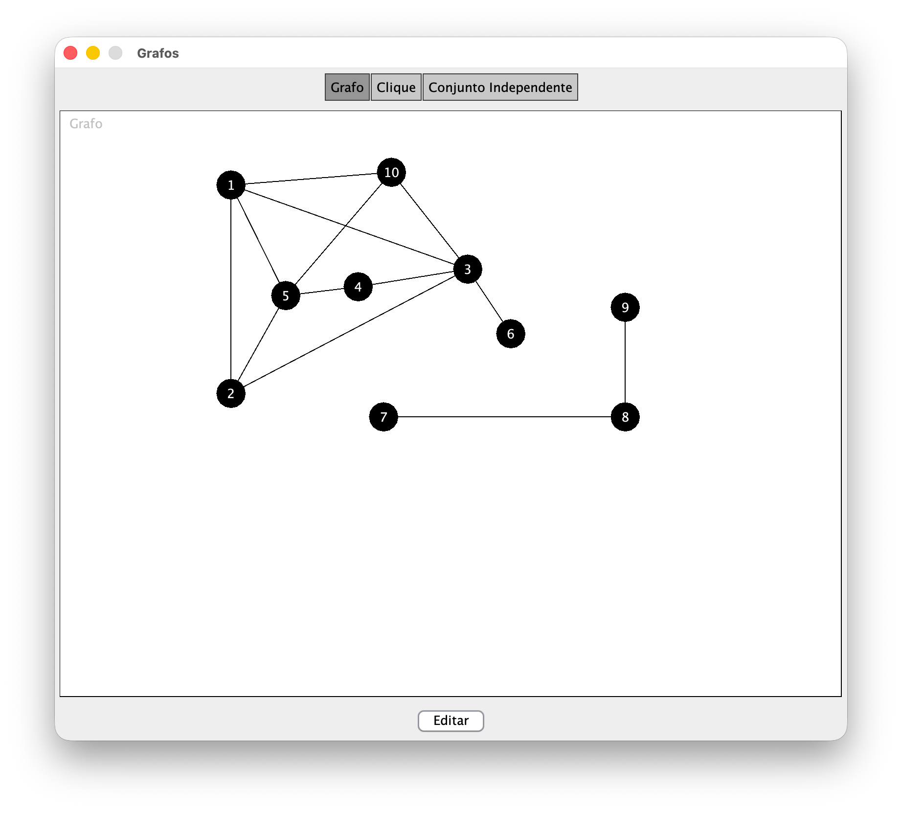
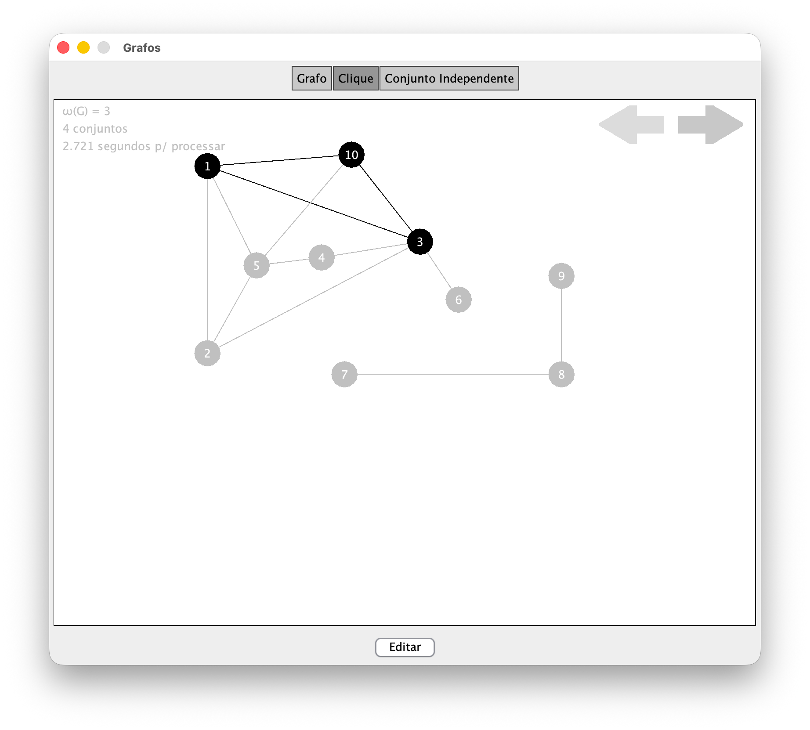

# Clique and Independent Set Calculator

This Java program lets you build a graph by hand and then analyze it to find cliques and independent sets. You can create nodes and connect them by clicking and dragging, and if you want to add a new node directly with a connection, you can drag from an existing node to a new position and release. After you finish building the graph, you can calculate the largest cliques and maximum independent sets, then drag the nodes around to rearrange the layout and visually inspect the structure more easily. The program is designed to make it simple to explore graph relationships and identify the largest subsets of mutually connected or mutually disconnected vertices.

The interface is intentionally simple and interactive: once your graph is ready, click the calculation button to find the groups of highest size, and then move nodes around to see the structure from different angles. The tool highlights the relevant cliques and independent sets, helping you understand which groups are largest and how they are connected. To remove elements, hold Ctrl to enter delete mode and click the node or edge you want to remove.

## Screenshots

### Graph creation

### Clique calculation

### Independent set calculation

